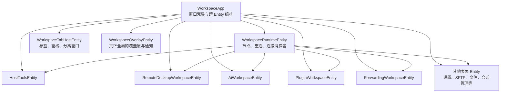

# WorkspaceApp 彻底瘦身执行计划

## 状态

- 基线提交：`fd04187a7aff1acafa8e285007a88fa7dea8e290`
- 制定日期：2026-07-26
- 当前阶段：规划完成，尚未开始架构迁移
- 执行原则：每个阶段独立提交、独立验证；上一个阶段未通过退出门槛，不得进入下一个阶段
- 验证边界：只做当前开发环境可执行的原生检查，不安排跨平台编译、虚拟机或人工多系统验证

## 结论与工期校准

最初的 30–50 个开发日估算只适合“移除根渲染轮询并拆出五个高负载子系统”，不足以同时完成 WorkspaceApp 的全面所有权重构。

当前代码基线显示：

- `WorkspaceApp` 约有 330 个直接字段，结构体本身占 341 行。
- 工作区代码中有 212 个 `impl WorkspaceApp` 块，分布在约 210 个文件。
- `workspace.rs` 有 1,349 行，包含大量跨子系统导入、常量、类型和状态。
- `WorkspaceApp::render` 开头直接调用 28 个轮询或刷新入口。
- 初始化代码还启动了一个每 530ms 运行一次的工作区心跳；一次心跳会调用约 34 个轮询、刷新或生命周期入口。
- `oxideterm-gpui-app/src/workspace` 共有约 213,345 行 Rust 代码。
- Host Tools、远程桌面、AI、插件和转发五个目标区域合计约 73,772 行。

据此，本计划采用以下估算：

| 交付范围 | 预计工作量 | 可验收结果 |
| --- | ---: | --- |
| 止血与基线 | 4–7 个开发日 | 队列有预算，重复扫描合并，隐藏表面停止非必要采样 |
| 根渲染无轮询 | 7–12 个开发日 | 根 `render` 不读取任何 worker channel |
| 五个高负载 Entity | 18–26 个开发日 | Host Tools、远程桌面、AI、插件、转发拥有状态、生命周期、投递和主要界面行为 |
| WorkspaceApp 全面收口 | 10–15 个开发日 | 节点运行时、标签、设置、终端命令、剩余表面和全局覆盖层重新归属 |
| 稳定化与最终审计 | 3–5 个开发日 | 静态指标、生命周期测试、性能证据和文档全部闭环 |
| **总计** | **42–65 个开发日** | `WorkspaceApp` 只保留窗口壳层、跨 Entity 编排和少量真正全局状态 |

如果只做到前四项中的“五个高负载 Entity”，工期可以接近原先的 30–50 个开发日；如果要求达到本文的最终定义，则应按 42–65 个开发日排期。Phase 2 完成后必须依据实际迁移速度重新估算一次。

## 目标

1. 根渲染只负责组合窗口壳层和已拥有的子 Entity，不再承担消息泵职责。
2. worker 结果主动唤醒并更新所属 Entity，不依赖下一次根渲染或统一 530ms 心跳才能生效。
3. Host Tools、远程桌面、AI、插件和转发各自拥有明确的 GPUI Entity。
4. SSH 节点、重连、SFTP 和转发运行时由工作区级运行时所有者管理，不依赖终端或页面生命周期。
5. 页面隐藏时停止该页面专属的采样、探测和刷新；必须继续运行的会话、传输、隧道和流式任务保持正确。
6. 将 `WorkspaceApp` 从业务状态和页面行为的总容器缩减为窗口级协调器。
7. 每次迁移都同时移动状态、状态转换、投递、生命周期、主要动作和测试，不做只搬字段的伪拆分。

## 非目标

- 不在本次工作中重新设计界面或改变用户流程。
- 不以机械减少文件行数替代所有权迁移。
- 不为了拆分而先创建五个新的 crate。
- 不把所有事件塞入一个无类型的全局总线。
- 不改变 SSH 节点、SFTP、转发或重连的产品生命周期语义。
- 不顺手清理与所有权迁移无关的旧代码。
- 不安排跨平台验证；平台专属问题仍由现有 CI 和后续平台任务处理。

## 不可破坏的架构约束

### 节点和会话

1. SSH 物理连接由连接注册表、`NodeRouter` 或明确的节点断开动作拥有。
2. 关闭终端只移除终端消费者，不得断开共享节点。
3. SFTP 使用节点支持的真实 SFTP 会话，不从任意终端反推连接。
4. 转发监听和桥接任务必须在转发页面关闭后继续存在，直到规则或节点明确停止。
5. 重连、健康检查、跳板子节点和长期任务必须有工作区级所有者、取消路径和完成路径。
6. 页面 Entity 只观察节点状态，不得从终端是否存在推断节点存活。

### 秘密

1. 拆分不得为密码、口令、私钥、令牌、代理凭据或插件敏感参数增加便利性克隆。
2. UI 草稿只在所属表单 Entity 中短暂存在；交给后端时转换为零化类型，并立即清理旧草稿。
3. 新 Entity、事件、诊断、日志和测试快照不得派生或输出秘密值。
4. 异步任务只移动最小必要的零化值，任务取消或完成时必须释放所有副本。
5. AI 和插件跨边界只使用脱敏快照、稳定引用或宿主代理，不接收原始终端、环境变量或凭据。

### GPUI 所有权

1. 每个长期 receiver 只能有一个 Entity 所有者。
2. 每个长期任务必须由定义其生命周期的 Entity 保存取消或完成句柄。
3. 子 Entity 通过自己的 `EventEmitter` 或窄宿主能力接口通信。
4. 最终状态下，高负载子 Entity 不得保存 `WeakEntity<WorkspaceApp>`。
5. 迁移期间的反向引用必须有删除任务，并且最多存在一个提交。
6. 子 Entity 隐藏不等于销毁；是否暂停由明确的可见性策略决定。

## 当前问题证据

### 根渲染消息泵

`crates/oxideterm-gpui-app/src/workspace/root/render.rs` 的 `Render::render` 在第 105–132 行依次处理：

- 转发 worker；
- WSL 图形 worker；
- 远程桌面 worker；
- Connection Monitor 和 14 类 Host Tools 结果；
- 连接跟踪与终端通知；
- 插件终端请求和产品 UI 副作用；
- AI 流、压缩、模型探测和模型刷新。

这些入口即使队列为空也会在根重新渲染时执行。部分入口还会把队列全部排空，使单帧耗时与后台积压量相关。

### 重复工作区心跳

`crates/oxideterm-gpui-app/src/workspace/root/init.rs` 第 723 行附近启动 530ms 心跳，同时轮询或刷新：

- SSH、节点事件、重连、启动器和图形；
- Connection Monitor 与全部 Host Tools；
- 外部设置、终端目录、Git 和项目状态；
- 转发结果、转发事件、端口探测和统计；
- 节点生命周期、活动连接探测；
- 终端录制、权限提示、上下文动作和光标闪烁。

根渲染与心跳共同调用图形、Host Tools、转发等入口，形成重复空扫描和所有权模糊。

### 已有可复用模式

本次迁移不得忽略已经存在的正确局部实现：

- SFTP 已使用 `cx.spawn` 等待异步 receiver，并在 UI 线程直接更新工作区。
- IDE 已是独立 `Entity<IdeSurface>`，通过 `IdeSurfaceEvent` 和 `cx.subscribe` 与工作区通信。
- 节点事件已有每 tick 64 条的数量预算。
- AI 流已有每次最多 256 条的数量预算和文本合并。
- 远程桌面已有 `RemoteDesktopWorkerWake`、帧槽、数量预算和时间预算，但唤醒后仍通过根渲染排空结果。

新方案应统一这些局部模式，而不是再引入一套平行机制。

## 目标架构



依赖方向必须保持单向：

- 非 UI domain crate 不依赖 `oxideterm-gpui-app`。
- 子 Entity 可以依赖已有 domain crate 和窄的工作区服务句柄。
- `WorkspaceApp` 可以保存子 Entity 句柄并订阅其事件。
- 子 Entity 不调用 WorkspaceApp 的任意方法集合。
- 跨子系统行为通过显式事件、服务句柄或专用适配器完成，不引入字符串命名空间总线。

## 最终责任合同

### WorkspaceApp

**拥有：**

- 主窗口 `FocusHandle`；
- 窗口级主题、渲染策略和透明效果；
- 子 Entity 句柄与订阅；
- 主壳层布局、左右侧栏布局和活动表面路由；
- 必须跨所有页面生效的快捷键与窗口动作；
- 应用锁对整个工作区的顶层阻断。

**不拥有：**

- worker receiver、轮询标志或后台任务；
- Host Tools、AI、插件、转发、远程桌面的业务状态；
- 节点连接、重连任务或转发任务的实际生命周期；
- 页面专属输入、搜索、列表、弹窗和滚动状态；
- 页面专属渲染函数。

### WorkspaceRuntimeEntity

**拥有：**

- `SshConnectionRegistry`、`NodeRouter`、`NodeRuntimeStore`；
- 节点事件订阅与 generation；
- SSH worker、重连 worker、重连编排和活动探测；
- SFTP、转发、终端和子节点消费者登记；
- 明确的工作区关闭取消流程。

**不拥有：**

- 终端窗格 UI；
- Host Tools、SFTP 或转发页面状态；
- 页面是否可见的产品判断。

### HostToolsEntity

**拥有：**

- 当前 `ConnectionMonitorState` 的全部状态和转换；
- Host Tools 的选择、搜索、排序、列表、弹窗和动作状态；
- 所有 Host Tools receiver、采样任务、刷新时间和投递；
- 标签页和右侧栏两种 Host Tools 表现；
- 页面可见性和采样启停策略。

**输入：**

- 节点运行时的只读句柄；
- 主题和本地化快照；
- `HostToolsVisibility`；
- 用户动作。

**输出：**

- 类型化的通知、终端打开、确认和节点操作意图。

### RemoteDesktopWorkspaceEntity

**拥有：**

- `TabId -> Entity<RemoteDesktopSessionEntity>` 映射；
- 每个会话的 worker、generation、帧槽、几何、输入、剪贴板策略和渲染资源；
- texture/image 退休和窗口资源清理；
- 连接、重连、关闭和隐藏后的帧策略。

**输出：**

- 标题更新、错误通知、会话结束和需要工作区协调的动作。

**限制：**

- 密码只从连接流程移动到 worker 一次；
- 页面隐藏时不得丢失断开、证书或剪贴板事件；
- 页面隐藏时可以合并帧并停止重绘，但不能默认断开传输。

### AiWorkspaceEntity

**拥有：**

- 当前 `AiWorkspaceState` 全部子状态；
- 对话流、压缩、模型刷新、模型探测、知识索引和审批；
- AI 侧栏、内联面板和 AI 设置页面的状态所有权；
- 流式消息合并和通知节流。

**输入：**

- 脱敏的工作区上下文快照；
- 受限的宿主能力；
- 用户动作和设置快照。

**输出：**

- 类型化工具请求、通知、终端或 IDE 导航意图。

**限制：**

- 隐藏时正在进行的对话流继续完成；
- 隐藏时停止模型在线探测、自动建议等非必要工作；
- 不得把 WorkspaceApp 或原始秘密捕获进长期任务。

### PluginWorkspaceEntity

**拥有：**

- `NativePluginRuntimeState`、`NativePluginManagerState` 和 `NativePluginUiState`；
- 插件进程/WASM 生命周期、确认、同步、进度和管理页面；
- 插件 UI 注册、插件表面和运行时请求投递；
- 插件管理页面隐藏后的探测策略。

**输入：**

- 明确分类的只读快照和宿主能力；
- 用户授权结果；
- 插件清单和安装动作。

**输出：**

- 类型化的产品宿主请求，不再把副作用暂存在根渲染消费的 `VecDeque`。

### ForwardingWorkspaceEntity

**拥有：**

- 转发页面状态、端口探测、统计投递和 UI worker；
- 转发规则与节点绑定的表示；
- 标签页和右侧栏所需的视图状态。

**运行时约束：**

- 实际监听器、桥接任务和连接消费者属于工作区级转发服务；
- 关闭转发页面不停止现有隧道；
- 明确停止规则或断开节点才释放任务和消费者。

## 投递模型

### 消息分类

| 类别 | 例子 | 队列策略 | 隐藏时策略 |
| --- | --- | --- | --- |
| 生命周期 | 连接、断开、错误、证书、确认 | 无损、有界、必要时背压 | 必须处理 |
| 用户动作完成 | 删除、启动、停止、导入、保存 | 无损、有界 | 必须处理并保存结果 |
| 流式文本 | AI 内容、思考片段 | 有界，按会话和类型合并相邻文本 | 继续处理，降低重绘 |
| 高频快照 | GPU、进程、端口、统计 | 每 key 保留最新值 | 停止生产或只保留最新值 |
| 帧 | RDP/VNC/WSL 图形 | 帧槽或最新值，显式恢复全帧 | 不重绘，保留连续性策略 |
| 通知 | toast、事件日志 | 去重、有上限 | 可延迟显示，不能泄漏秘密 |

### 通用预算

创建一个纯逻辑预算类型，而不是在每个 poller 中散落数字：

```rust
struct DeliveryBudget {
    max_items: usize,
    max_elapsed: Duration,
}

struct DrainOutcome {
    processed: usize,
    backlog_remaining: bool,
    elapsed: Duration,
}
```

要求：

- 常量必须有语义化名称并按消息类别配置；
- 每次排空同时受数量和时间限制；
- 达到预算后只安排一次后续 UI 任务，不通过无限 `cx.notify()` 自激；
- 关键生命周期消息优先于快照；
- 不得合并错误、确认、状态转换或用户动作完成；
- 高频快照按稳定 key 合并；
- 测试使用可控的已处理数量和显式 elapsed 输入，不依赖睡眠制造时间边界。

### 主动投递

优先使用 GPUI 前台任务等待异步 receiver：

1. worker 向有界异步 channel 发送所属 Entity 的 delivery；
2. Entity 构造时启动一个 `cx.spawn` 任务等待 receiver；
3. 收到 delivery 后通过该 Entity 的 weak handle 更新自身；
4. 处理完可见状态后只通知该 Entity；
5. Entity drop 或显式 shutdown 关闭 channel、取消任务并完成清理。

对于暂时不能替换的 `std::sync::mpsc`：

- 可以增加一次性的线程到异步 channel 桥接；
- 桥接由所属 Entity 保存停止和完成句柄；
- 不允许以固定 Timer 永久探测空队列作为最终实现。

## 可见性策略

| 子系统 | 可见时 | 隐藏时 | 不得发生 |
| --- | --- | --- | --- |
| Host Tools | 启动当前工具所需采样和刷新 | 停止 GPU、进程、日志、服务等页面采样；动作完成仍处理 | 因隐藏而断开 SSH 节点 |
| 远程桌面 | 正常帧处理、输入、resize | 继续传输必要事件；合并帧并停止无意义重绘 | 因隐藏丢失证书、断开或剪贴板事件 |
| AI | 正常流、探测和列表刷新 | 活动流继续；停止模型在线探测和非必要建议 | 因隐藏取消用户已发送的请求 |
| 插件 | 运行时和管理 UI 正常 | 插件运行时继续；管理页探测和 profiler 可暂停 | 因关闭管理页停止插件宿主 |
| 转发 | 页面统计和端口探测正常 | 隧道继续；页面统计和端口扫描暂停 | 因关闭页面停止 listener |
| 设置 | 打开时检查页面专属状态 | 停止页面专属探测 | 丢失已提交的保存或更新结果 |
| 节点运行时 | 与页面无关 | 与页面无关 | 从终端或页面可见性推断节点存活 |

可见性必须是一个显式状态机，至少区分：

- `VisibleMainTab`
- `VisibleSidebar`
- `VisibleDetachedWindow`
- `Hidden`
- `Dropped`

同一子系统可能同时在主标签和侧栏可见；只在所有挂载点都隐藏时暂停页面采样。

## 分阶段执行

### Phase 0：冻结基线与建立审计工具（1–2 日）

任务：

- [ ] 新建 `scripts/audit_workspace_app.py`，输出并可选校验：
  - `WorkspaceApp` 直接字段数；
  - `impl WorkspaceApp` 数量和文件数；
  - 根 `render` 中的 `poll_*`、`try_recv` 和 `recv`；
  - WorkspaceApp 直接 receiver/sender 数量；
  - 高负载目录行数；
  - 高负载目录中的 `WeakEntity<WorkspaceApp>` 数量。
- [ ] 记录本文基线指标，确认脚本结果与人工审计一致。
- [ ] 为以下运行场景增加调试计数，不记录任何内容值：
  - 空闲工作区；
  - Host Tools 隐藏/可见；
  - AI 流隐藏/可见；
  - 远程桌面隐藏/可见；
  - 插件运行时隐藏/可见；
  - 转发页面关闭但隧道仍运行。
- [ ] 记录根渲染触发次数、每类 delivery 数量、预算命中、积压和通知次数。
- [ ] 明确每个现有 receiver 的消息类别、所有者、生产者、取消路径和溢出策略。

退出门槛：

- 审计脚本可重复运行；
- 所有 28 个根渲染入口和 530ms 心跳入口都有所有权记录；
- 没有 receiver 被标记为“以后再判断”。

### Phase 1：止血（3–5 日）

涉及文件：

- `workspace/root/render.rs`
- `workspace/root/init.rs`
- `workspace/tabs/nodes.rs`
- `workspace/remote_desktop/*`
- `workspace/sidebar/ai/*`
- `workspace/connection_monitor/*`
- `workspace/forwards/*`
- `workspace/plugin_lifecycle/*`

任务：

- [ ] 引入共用 `DeliveryBudget` 和 `DrainOutcome`。
- [ ] 给转发、图形、远程桌面、终端通知、连接跟踪和插件 UI 队列增加预算。
- [ ] 保留 AI、节点和远程桌面已有预算语义，改为共用或兼容同一审计接口。
- [ ] 将根渲染和 530ms 心跳的重复入口归并到唯一触发位置。
- [ ] 将“周期刷新”和“worker 完成投递”分开；完成投递不得等待下一个周期刷新。
- [ ] 为每个页面专属 sampler 增加显式可见性门槛。
- [ ] 隐藏 Host Tools 后停止对应 sampler、日志快照和自动刷新。
- [ ] AI、插件、远程桌面和转发按上表实现隐藏策略。
- [ ] 预算命中时安排一次继续处理，禁止每条消息分别 `cx.notify()`。
- [ ] 增加积压、公平性、快照合并、关键消息不丢失和隐藏策略测试。

退出门槛：

- 任一 delivery 入口单次处理都有数量或时间上限；
- 根渲染和心跳不再重复读取同一个 receiver；
- Host Tools 全部隐藏时不产生页面采样命令；
- 活动 AI 流、远程桌面连接、插件运行时和转发隧道不因隐藏而终止。

### Phase 2：移除根 render 轮询（7–12 日）

迁移顺序：

1. 远程桌面：复用现有 `RemoteDesktopWorkerWake`，在所属 Entity 更新中直接排空，不再只触发根重绘。
2. 图形和转发：把简单 `std::sync::mpsc` 结果改为主动投递。
3. Host Tools：将 action/snapshot/sampler delivery 转到 Host Tools 所有者。
4. AI：把 50ms Timer 探测替换为 receiver 等待和预算化应用。
5. 插件：把终端 UI 请求和产品 UI 副作用改为类型化主动投递。
6. 终端通知和连接跟踪：迁移到独立通知/诊断所有者。

任务：

- [ ] 每个 receiver 启动一个所属 Entity 的等待任务。
- [ ] 保留 generation 检查，旧会话消息不得更新新会话。
- [ ] 根 `Render::render` 删除全部 `poll_*` 和 `try_recv`。
- [ ] 530ms 心跳只保留真正按时间运行的工作，不再承担完成队列消息泵。
- [ ] 心跳中的节点、重连、终端环境等后续交给 Phase 4 的所有者。
- [ ] 为 Entity drop、channel 关闭、worker 停止和积压续处理增加测试。
- [ ] 审计所有 `cx.notify()`，确保通知所属 Entity 而不是借根渲染排空。

退出门槛：

- `WorkspaceApp::render` 中 `poll_*`、`try_recv`、`recv` 数量为 0；
- worker 完成事件不需要额外用户输入或定时心跳即可显示；
- 空闲根渲染不执行任何 channel 空检查；
- receiver 和等待任务的数量在 Entity 创建/销毁前后保持可解释。

### Phase 3：五个高负载子系统拥有 GPUI Entity（18–26 日）

#### Phase 3A：HostToolsEntity（5–7 日）

- [ ] 在现有 `workspace/connection_monitor` 模块内新增 `entity.rs`、`events.rs` 和 `delivery.rs`。
- [ ] 把 `ConnectionMonitorState`、Host Tools 列表和滚动状态、活动 section、receiver 和任务移入 Entity。
- [ ] 把 `connection_monitor/**` 中的 `impl WorkspaceApp` 改为 `impl HostToolsEntity`。
- [ ] 根只保存 `Entity<HostToolsEntity>` 和一个订阅。
- [ ] 主标签和右侧栏读取同一个 Entity，不复制状态。
- [ ] NodeRouter/registry 通过工作区运行时只读句柄提供。
- [ ] 关闭最后一个 Host Tools 挂载点后暂停 sampler。

退出门槛：

- `connection_monitor/**` 不再定义 `impl WorkspaceApp`；
- WorkspaceApp 不再拥有 Host Tools receiver、polling flag、列表或弹窗字段；
- Host Tools 隐藏测试和节点独立生命周期测试通过。

#### Phase 3B：RemoteDesktopWorkspaceEntity（3–4 日）

- [ ] 建立工作区级会话注册 Entity 和每 tab 的 `RemoteDesktopSessionEntity`。
- [ ] 把 worker、generation、wake、frame slot、geometry、输入和渲染资源移到会话 Entity。
- [ ] 会话 Entity 自己处理 delivery 和帧预算。
- [ ] 根只负责将 `TabId` 路由到会话 Entity。
- [ ] 确保 texture/image 在拥有对应 `Window` 的路径中清理。
- [ ] 密码一次性移动进 worker，并覆盖成功、失败、取消和超时路径。

退出门槛：

- `remote_desktop/**` 不再定义 `impl WorkspaceApp`；
- WorkspaceApp 不再拥有远程桌面 worker sender/receiver 或会话业务状态；
- 隐藏、分离窗口、重连、剪贴板和渲染资源回收测试通过。

#### Phase 3C：ForwardingWorkspaceEntity（2–3 日）

- [ ] 把 `ForwardsViewState`、端口探测、统计、页面列表和 UI worker 移入 Entity。
- [ ] 把实际 forwarding runtime 和消费者句柄放在工作区级运行时服务。
- [ ] Entity 通过显式服务接口请求创建、停止、扫描和读取统计。
- [ ] 关闭 tab/侧栏只卸载视图，不停止隧道。

退出门槛：

- `forwards/**` 不再定义 `impl WorkspaceApp`；
- 转发监听在最后一个终端窗格和转发页面关闭后仍按规则存活；
- 明确停止和节点断开能完成有界清理。

#### Phase 3D：AiWorkspaceEntity（4–6 日）

- [ ] 将已经聚合的 `AiWorkspaceState` 直接转换为 Entity 所有状态，禁止再次复制字段。
- [ ] 迁移流、压缩、模型、知识、审批和设置动作。
- [ ] AI 侧栏、内联面板和设置页通过同一状态所有者渲染或订阅。
- [ ] 把终端、SFTP、IDE、设置等上下文访问改为脱敏快照和窄能力。
- [ ] 删除 AI poller、polling flag 和根方法。
- [ ] 审计所有异步捕获、`Debug`、错误、通知和持久化边界。

退出门槛：

- `sidebar/ai/**` 和 `settings/ai/**` 不再定义 `impl WorkspaceApp`；
- WorkspaceApp 不再拥有 AI receiver 或对话业务状态；
- 隐藏时流继续完成，非必要探测停止；
- 秘密和终端原文不会进入新增事件或诊断。

#### Phase 3E：PluginWorkspaceEntity（4–6 日）

- [ ] 合并迁移 `NativePluginRuntimeState`、`NativePluginManagerState` 和 `NativePluginUiState`。
- [ ] 迁移插件确认、终端请求、同步、进度、profiler、manager 和插件 UI。
- [ ] 用类型化宿主请求替换根渲染消费的 `product_ui_effects`。
- [ ] 把连接、通知、快捷命令、IDE、AI 和云同步能力拆成明确适配器。
- [ ] 插件管理页面可见性不得控制插件运行时生命期。
- [ ] 保留默认脱敏只读数据平面和对敏感/副作用操作的现有授权规则。

退出门槛：

- `plugin_lifecycle/**`、`plugin_manager.rs` 和 `plugin_ui.rs` 不再定义 `impl WorkspaceApp`；
- WorkspaceApp 不再拥有插件 worker、队列、polling flag 或管理 UI 状态；
- 隐藏管理页后插件宿主仍能处理合法请求；
- 未授权副作用和秘密数据仍被拒绝。

### Phase 4：WorkspaceApp 全面收口（10–15 日）

按以下顺序继续迁移，禁止一次大改：

#### Phase 4A：WorkspaceRuntimeEntity

- [ ] 迁移 SSH worker、节点图、节点事件、重连、活动探测和连接消费者。
- [ ] 把 530ms 心跳拆成所属 Entity 的定时任务。
- [ ] 保持节点独立于终端、SFTP、转发和 Host Tools 页面。
- [ ] 根只保留一个运行时 Entity 句柄。

#### Phase 4B：WorkspaceTabHostEntity

- [ ] 迁移 tabs、panes、terminal locations、导航历史、分离窗口和 ID 分配。
- [ ] 迁移 tab/pane 关闭、移动、分屏、返回主窗口和订阅生命周期。
- [ ] 保持 `TerminalPane` 和 `IdeSurface` 的现有 Entity 所有权。

#### Phase 4C：WorkspaceTerminalEntity

- [ ] 迁移命令栏、广播、快捷命令、CWD、Git、项目、录制和 cast 状态。
- [ ] 把 terminal notice 投递交给终端或通知所有者。
- [ ] 局部键盘事件由终端 Entity 处理，根只保留真正全局快捷键。

#### Phase 4D：SettingsWorkspaceEntity 和 ConnectionFlowEntity

- [ ] 迁移 settings page、portable、update、managed key、proxy、privilege 和输入草稿。
- [ ] 迁移新建连接、host key、keyboard-interactive 和保存/复制流程。
- [ ] 秘密草稿由所属表单 Entity 独占，提交或取消后清理。

#### Phase 4E：剩余表面

- [ ] 迁移 SFTP、文件管理器、Session Manager、Cloud Sync、Launcher 和 Graphics。
- [ ] 已经有独立 Entity 的 IDE 保持现有方向，只缩减根适配器。
- [ ] 将页面弹窗、搜索、列表和滚动状态归还页面所有者。

#### Phase 4F：全局覆盖层与输入

- [ ] 将真正全局的 toast、tooltip、命令面板和确认路由放入 `WorkspaceOverlayEntity`。
- [ ] IME、选择和拖动只在确实跨页面时留在根；页面专属部分移入页面 Entity。
- [ ] 将根键盘捕获链缩减为全局快捷键、应用锁和当前 Entity 路由。

退出门槛：

- `WorkspaceApp` 直接字段不超过 60 个；
- `workspace.rs` 不超过 500 行；
- `WorkspaceApp` 结构体不超过 120 行；
- 全仓 `impl WorkspaceApp` 不超过 40 个；
- WorkspaceApp 直接 receiver 字段为 0；
- WorkspaceApp 直接长期任务/polling flag 为 0；
- 页面目录中不存在为了访问根状态而新增的 `WeakEntity<WorkspaceApp>`。

### Phase 5：稳定化与最终审计（3–5 日）

- [ ] 运行静态审计脚本并把结果更新到本文。
- [ ] 删除全部迁移 shim、重复字段、过渡 re-export 和废弃 polling flag。
- [ ] 检查新模块没有成为大 `lib.rs` 或纯 re-export 容器。
- [ ] 检查 domain crate 不依赖 app crate 或 GPUI。
- [ ] 检查每个长期任务的 owner、取消、完成和 drop。
- [ ] 检查每个秘密的 owner、handoff 和清理。
- [ ] 检查所有高负载列表仍由 GPUI `List`/虚拟列表拥有滚动。
- [ ] 检查隐藏策略不会改变节点、隧道、传输、插件或 AI 流生命期。
- [ ] 记录最终指标、剩余例外和书面理由。

退出门槛：

- 本文“最终完成定义”全部满足；
- 不存在未记录的例外；
- 所有阶段提交可单独解释并可按阶段回退。

## 字段和方法迁移清单

| 当前所有者 | 目标所有者 | 必须一起移动 |
| --- | --- | --- |
| `connection_monitor`、Host Tools list/cache、Host Tools scroll | `HostToolsEntity` | sampler、action、snapshot、dialog、search、render、key handling、tests |
| `remote_desktop_sessions`、worker tx/rx | `RemoteDesktopWorkspaceEntity` / session Entity | wake、frame slot、texture、clipboard、input、resize、tests |
| `ai` 与 AI dialog/editor | `AiWorkspaceEntity` | stream、model、knowledge、approval、sidebar、settings、redaction tests |
| 三个 native plugin state | `PluginWorkspaceEntity` | runtime、manager、UI、confirm、host calls、progress、tests |
| forwarding view、port detection、worker/event rx | `ForwardingWorkspaceEntity` | UI actions、stats、scan、cloud-sync dirty event、tests |
| SSH/node/reconnect 字段 | `WorkspaceRuntimeEntity` | worker、router、registry、consumer、cascade、probe、tests |
| tabs/panes/detached 字段 | `WorkspaceTabHostEntity` | navigation、split、focus、window handoff、subscriptions、tests |
| terminal command/CWD/Git/project/cast | `WorkspaceTerminalEntity` | local actions、delivery、keyboard route、tests |
| settings 与 connection flow 字段 | 对应 Entity | secret draft、validation、async handoff、modal、tests |
| SFTP、文件、会话管理、Cloud Sync、Launcher、Graphics | 对应表面 Entity | state、actions、worker、render、visibility、tests |
| toast、tooltip、真正全局确认 | `WorkspaceOverlayEntity` | notification、dedupe、exit presence、global key routing |

迁移一项时必须在同一个提交中删除旧字段或旧行为。不得让新旧所有者同时写同一状态超过一个提交。

## 提交策略

建议提交序列：

1. `test(workspace): add ownership and dispatch audit`
2. `perf(workspace): budget background deliveries`
3. `perf(workspace): pause hidden surface sampling`
4. `refactor(workspace): move deliveries out of root render`
5. `refactor(host-tools): introduce owned GPUI entity`
6. `refactor(remote-desktop): move sessions into GPUI entities`
7. `refactor(forwarding): separate UI and tunnel ownership`
8. `refactor(ai): introduce owned GPUI entity`
9. `refactor(plugins): introduce owned GPUI entity`
10. `refactor(workspace): extract runtime ownership`
11. `refactor(workspace): extract tab and terminal ownership`
12. `refactor(workspace): extract settings and remaining surfaces`
13. `refactor(workspace): reduce root overlays and input routing`
14. `docs(workspace): record final ownership audit`

每个提交要求：

- 只做一个所有权切片；
- 构建始终可恢复；
- 不混入界面重设计；
- 写清楚英文所有权注释；
- 包含对应测试；
- 通过后立即推送，作为下一阶段回退点。

## 验证矩阵

### 每个切片

- `cargo fmt --check`
- 受影响 crate 的 focused tests
- `cargo check -p oxideterm-gpui-app`
- `cargo test -p oxideterm-gpui-app -- --test-threads=1`
- `python3 scripts/audit_workspace_app.py`
- `git diff --check`

### 节点和运行时

- 关闭最后一个终端后，已登记的其他消费者仍可使用节点。
- 不打开终端也能建立节点支持的 SFTP。
- 本地、远程和动态转发在终端关闭后继续运行。
- 明确断开父节点会按记录关系处理子节点和依赖任务。
- grace period 重连不丢失无关页面状态。
- 工作区关闭后长期任务能完成有界清理。

### 可见性

- Host Tools 全部隐藏后 sampler 命令计数不再增加。
- Host Tools 再次显示时只恢复当前需要的 sampler。
- AI 流隐藏后仍能完成，但模型探测停止。
- 远程桌面隐藏后不持续根重绘，断开和剪贴板事件仍处理。
- 插件管理页隐藏后插件运行时仍响应。
- 转发页关闭后 listener 仍运行，统计刷新停止。

### 投递

- 积压超过预算时 UI 仍能响应其他事件。
- 多个队列同时积压时不会由一个队列永久占用 UI。
- 快照只保留最新值时，生命周期和错误消息不会被合并。
- 旧 generation 消息不会更新新会话。
- Entity drop 后 producer 能得到关闭信号，不会永久阻塞。

### 秘密

- `Debug`、错误、toast、trace 和审计指标不包含代表性秘密。
- 设置或连接元数据序列化不包含秘密值。
- 成功、失败、取消和超时后旧秘密草稿被清理。
- AI 和插件新增快照只含脱敏字段。

## 对抗式审计结果

### 质疑 1：为什么不直接把五个状态包装成 Entity？

因为 AI 和 Host Tools 已经大体被包装成单个状态字段，但 212 个 `impl WorkspaceApp`、receiver、任务、渲染和输入仍属于根。只包装字段不会改变所有权，也不会降低根渲染风险。

**约束：** 每个 Entity 切片必须同时减少字段、`impl WorkspaceApp`、receiver 和根事件分支。

### 质疑 2：页面隐藏后停止所有工作是否更省资源？

这会错误停止 AI 流、插件运行时、远程桌面必要事件和转发隧道。

**约束：** 只停止页面专属采样与刷新；生命周期和用户已启动任务按可见性矩阵继续。

### 质疑 3：能否让所有 worker 都发送一个 `WorkspaceEvent`？

一个通用事件总线会把 WorkspaceApp 从字段上帝对象变成事件上帝对象，所有权问题仍然存在。

**约束：** 每个子系统拥有独立 delivery 和事件类型；跨系统能力使用窄适配器。

### 质疑 4：子 Entity 保存 `WeakEntity<WorkspaceApp>` 最省改动，为什么禁止？

它会保留隐式双向依赖，子系统仍可任意修改根状态，无法证明所有权已经移动。

**约束：** 迁移 shim 最多存活一个提交；最终只允许根订阅子 Entity。

### 质疑 5：为什么不先拆成五个新 crate？

当前 UI 模块大量依赖根的主题、输入、节点、通知和窗口方法。先拆 crate 会制造循环依赖、re-export 容器和大量无意义适配器。

**约束：** 先在 app crate 内建立真实 Entity 边界。只有边界稳定且满足以下条件时才建 crate：

- 有独立、连贯的责任；
- 至少两个实质模块；
- `lib.rs` 通常少于 200 行；
- 不依赖 `oxideterm-gpui-app`；
- 移动的是行为和测试，不只是类型。

### 质疑 6：把所有 channel 改成有界队列会不会死锁？

如果 UI 线程同步发送到自己消费的队列，或生命周期消息共享可丢弃快照策略，确实可能死锁或丢状态。

**约束：**

- UI 线程不做阻塞发送；
- 生命周期和用户动作结果使用无损有界通道与异步背压；
- 高频快照使用 `try_send`、latest-by-key 或 frame slot；
- 每类消息书面记录溢出策略。

### 质疑 7：远程桌面 Entity 如何处理必须访问 `Window` 的纹理清理？

如果 delivery 任务没有正确窗口上下文，简单搬到后台 Entity 会破坏资源释放和缩放。

**约束：** 远程桌面保留 window handle 或由挂载的 session view 在 UI 更新中完成纹理操作；不得在线程中触碰 GPUI 资源。

### 质疑 8：节点运行时是否应该随 TabHost 一起移动？

不应该。节点、SFTP、转发和重连必须独立于终端和标签生命周期。

**约束：** `WorkspaceRuntimeEntity` 与 `WorkspaceTabHostEntity` 分开，前者的生命期覆盖整个工作区。

### 质疑 9：30–50 日是否足够？

只实现根无轮询和五个高负载 Entity 时可能足够；要把 330 个字段和 212 个根实现块降到最终门槛，30 日明显不足。

**修订：** 以 42–65 日作为全面目标，Phase 2 后重新估算。

### 质疑 10：如何防止迁移期间长期处于双写状态？

双写会造成难以复现的状态覆盖和退出顺序错误。

**约束：** 一个状态只允许一个写所有者；每次迁移在同一提交中切换所有者并删除旧写路径。过渡适配器只读。

## 停止并重新规划的条件

出现任一情况必须停止当前切片并更新本文：

- 新 Entity 需要三个以上任意 WorkspaceApp 回调才能工作；
- 迁移后字段数、根实现块或根事件分支没有下降；
- 新 crate 主要由 `pub use` 或单个大 `lib.rs` 构成；
- 同一状态出现两个长期写所有者；
- receiver 没有明确的溢出、取消或 drop 策略；
- 隐藏策略使节点、传输、隧道、插件或 AI 流意外停止；
- 为了通过借用检查而复制秘密或持有完整 WorkspaceApp；
- 一个提交同时迁移多个不相关表面，无法独立回退；
- focused tests 无法证明生命周期边界。

## 回滚策略

- 每个阶段开始前记录远端基线提交。
- 每个 Entity 独立提交并推送，不压缩尚未稳定的检查点。
- 发生回归时优先回退当前 Entity 切片，不回退已经验证的预算和主动投递基础设施。
- 不使用长期双路径 feature flag；短期迁移开关必须在同一阶段删除。
- 不删除旧测试；先让旧行为测试在新所有者上通过，再删除确实无效的测试工具。

## 最终完成定义

只有同时满足以下条件，才可以宣称 WorkspaceApp 已彻底瘦身：

- [ ] 根 `render` 没有 channel 轮询。
- [ ] 530ms 工作区心跳不承担任何 worker 完成投递。
- [ ] 五个高负载子系统各自拥有 GPUI Entity。
- [ ] WorkspaceApp 直接字段不超过 60 个。
- [ ] `workspace.rs` 不超过 500 行。
- [ ] WorkspaceApp 结构体不超过 120 行。
- [ ] 全仓 `impl WorkspaceApp` 不超过 40 个。
- [ ] WorkspaceApp 没有直接 receiver、polling flag 或长期 worker 句柄。
- [ ] SSH 节点、SFTP、转发和重连满足独立生命周期约束。
- [ ] 页面隐藏策略通过自动化测试。
- [ ] 秘密所有权、脱敏和清理检查通过。
- [ ] 新 Entity 没有未记录的 WorkspaceApp 反向引用。
- [ ] 新 crate 或模块符合责任边界规则。
- [ ] 所有 focused tests、原生 app check、格式和静态审计通过。
- [ ] 本文更新了最终指标、例外和验证结果。

## 执行者工作规则

1. 先完整阅读本计划、根目录 `AGENTS.md`、`tasks/lessons.md` 和三个相关技能：
   - `split-crate-by-responsibility`
   - `oxideterm-node-session-ownership`
   - `oxideterm-secret-zeroize`
2. 从 Phase 0 开始，不跳过基线和审计。
3. 每次只迁移一个责任切片。
4. 每个切片完成后更新本文复选框和指标。
5. 每个切片运行 focused tests、原生 app check、格式和静态审计。
6. 每个阶段提交并推送后再进入下一阶段。
7. 不做跨平台验证。
8. 不在迁移过程中重新设计 UI。
9. 不因任务规模大而停在分析或部分重构；持续执行到最终完成定义满足，除非命中“停止并重新规划的条件”。
